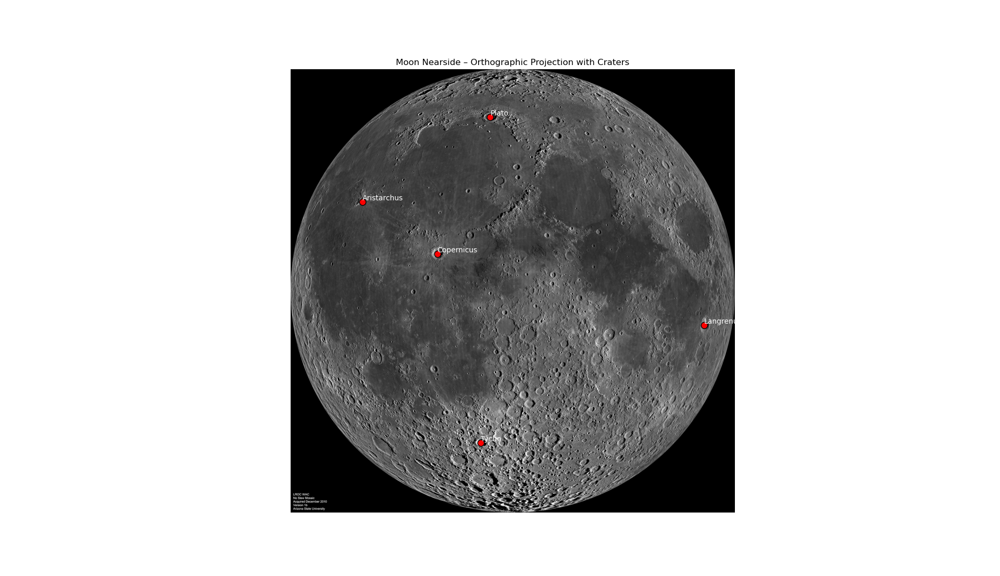

# maps
### tools to handle sky maps and planetary maps
### cities_map_001.py
### convert_messier.py
### messier_to_aitoff.py
### mollweide_cities.py
### ortographic_earth.py
### sites_map_001.py
	$ cat lunar_crater_sites.txt 
	#Lat(Y) Lon(X)  Name
	-43.31  -11.36  Tycho
	+9.62   -20.08  Copernicus
	+51.6   -9.3    Plato
	+23.73  -47.49  Aristarchus
	-8.9    +60.9   Langrenus

### superimpose_moon.py

### zip.py
### cos-plot.gp
### histo001.gp
### mercator_cities.gp
### mercator_moon.gp
### messier_mollweide.gp
### mollweide.gp
### moon_eqc.gp
### new_plot.gp
### ortographic.gp
### plot_messier.gp
### plot_messier_new.gp
### plot_messier_preproc.gp
### temp.gp
